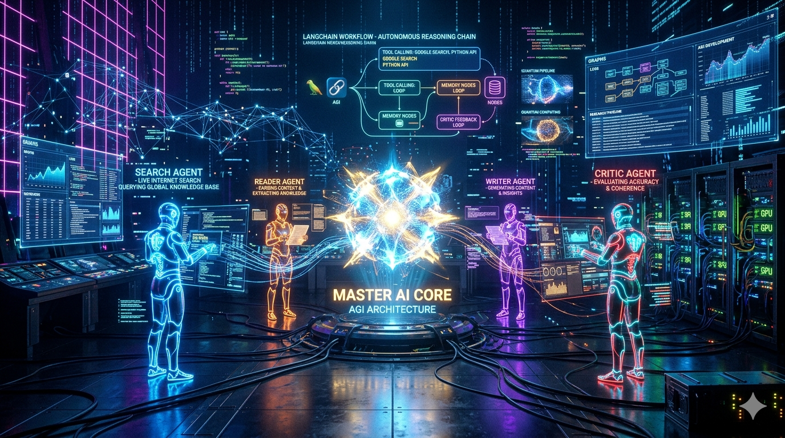
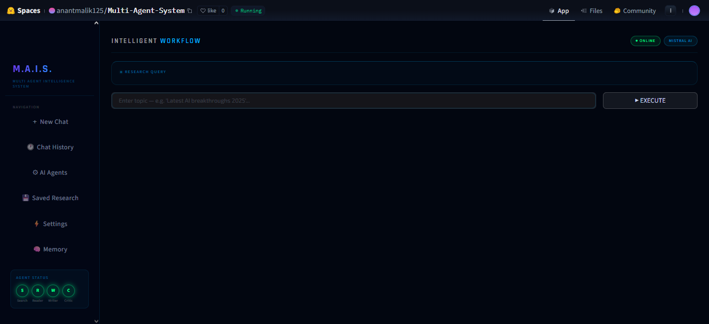
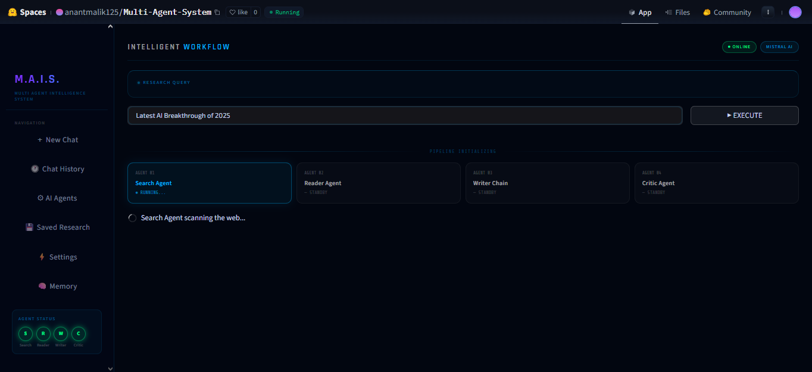

<div align="center">



</div>


<div align="center">

# 🤖 M.A.I.S.
### Multi-Agent Intelligence System


<br/>

[](https://huggingface.co/spaces/anantmalik125/Multi-Agent-System)
[]()
[]()
[]()
[]()
[]()

<br/>


<br/>

> 🚀 A futuristic AGI-inspired Multi-Agent AI System where autonomous AI agents collaborate to perform intelligent web research, scraping, report generation, and self-critique in real time.

<br/>

# 🌐 LIVE DEMO

## 🔗 Hugging Face Space

### https://huggingface.co/spaces/anantmalik125/Multi-Agent-System

<br/>



<br/><br/>



</div>

---

# ⚡ SYSTEM ARCHITECTURE


---

# 🧠 MULTI-AGENT WORKFLOW

| Agent | Responsibility |
|---|---|
| 🔍 Search Agent | Finds recent and reliable web information |
| 📖 Reader Agent | Scrapes and extracts useful content |
| ✍️ Writer Agent | Generates professional research reports |
| 🧠 Critic Agent | Reviews and improves report quality |

---

# ✨ FEATURES

```diff
+ 🤖 Autonomous Multi-Agent AI System
+ 🌐 Real-Time Web Search
+ 📚 Intelligent Web Scraping
+ 🧠 AI-Powered Research Generation
+ ⚡ LangGraph Agent Orchestration
+ 🔥 Futuristic Cyberpunk UI
+ 🎨 Fully Animated Streamlit Dashboard
+ 🛰️ Live AI Workflow Visualization
+ 🚀 Hugging Face Deployment Ready
+ 🧩 Modular Architecture
```

---

# 🛠️ TECH STACK

<div align="center">

| Frontend | Backend | AI/LLM | Deployment |
|---|---|---|---|
| Streamlit | Python | Mistral AI | Hugging Face |
| Custom CSS | LangChain | Tavily Search | Docker |
| Plotly | LangGraph | BeautifulSoup | Spaces |

</div>

---

# 📂 PROJECT STRUCTURE

```bash
multi-agent-system/
│
├── app.py
├── pipeline.py
├── agents.py
├── tools.py
├── requirements.txt
├── Dockerfile
├── .gitattributes
│
├── assets/
│   ├── banner.png
│   ├── dashboard.png
│   ├── live-ui.png
│   ├── bg.mp4
│   └── styles.css
│
└── .streamlit/
    └── config.toml
```

---

# ⚙️ INSTALLATION

## 1️⃣ Clone Repository

```bash
git clone https://github.com/your-username/multi-agent-system.git

cd multi-agent-system
```

---

## 2️⃣ Install Dependencies

```bash
pip install -r requirements.txt
```

---

## 3️⃣ Create `.env`

```env
MISTRAL_API_KEY=your_key
TAVILY_API_KEY=your_key
```

---

## 4️⃣ Run Application

```bash
streamlit run app.py
```

---

# 🚀 DEPLOYMENT

## 🤗 Hugging Face Spaces

1. Create New Space
2. Select Streamlit SDK
3. Upload Files
4. Add Secrets:
   - `MISTRAL_API_KEY`
   - `TAVILY_API_KEY`
5. Deploy 🚀

---

# 🖥️ UI PREVIEW

<div align="center">


<br/>


</div>

---

# 🔥 FUTURE ROADMAP

- 🧠 Long-Term AI Memory
- 🔄 Streaming Agent Responses
- 📄 PDF Export
- 🌍 RAG Knowledge Base
- 🛰️ Live Agent Monitoring
- 🎤 Voice AI Agents
- 🤝 Agent Collaboration Graph
- 🧬 Autonomous Planning System

---

# 👨‍💻 AUTHOR

<div align="center">

## Anant Malik

### Building futuristic autonomous AI systems 🚀

<br/>

[](https://github.com/your-username)

</div>

---

<div align="center">

# ⭐ STAR THIS PROJECT ⭐


</div>
